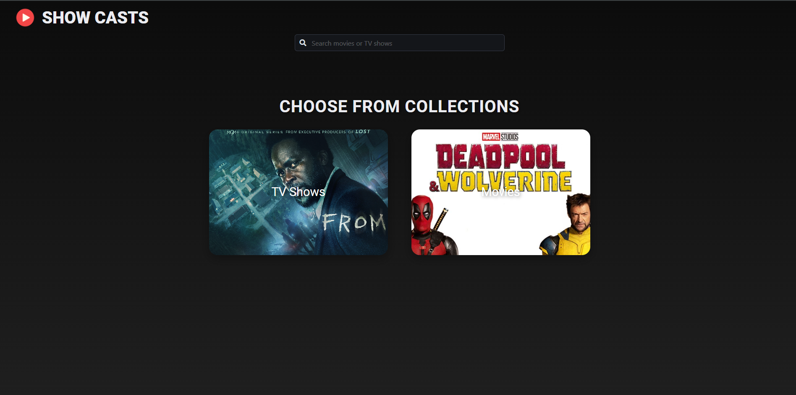
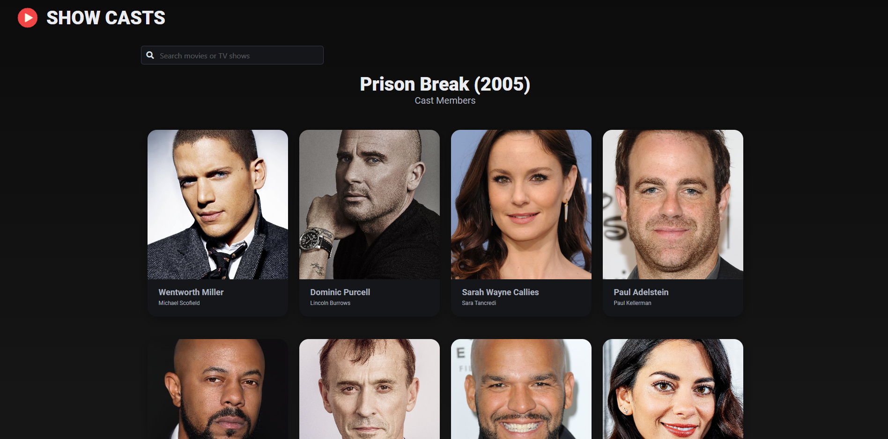

# Show Cast App 🎬

Show Cast is a sleek and responsive web application that allows users to explore a variety of TV shows and movies by categories. Built with Vue.js and styled with Bulma SCSS, it offers an intuitive interface and seamless user experience.



---

## Features ✨

- **Explore Cast**: View the cast of any TV show or movie.
- **Dynamic Category Selection**: Easily toggle between TV Shows and Movies.
- **Responsive Design**: Optimized for mobile, tablet, and desktop views.

- **Modern Tech Stack**: Built with Vite, Vue.js, and Bulma for fast performance and clean UI.

---

## Tech Stack 💻

- **Frontend**: [Vue.js](https://vuejs.org/)
- **Styling**: [Bulma SCSS](https://bulma.io/)
- **Build Tool**: [Vite](https://vitejs.dev/)

## Installation 🛠️

1. Clone the repository:
   ```bash
   git clone https://github.com/your-username/show-cast.git
   ```
2. Navigate to the project directory:

   ```bash
   cd show-cast
   ```

3. Install dependencies:

   ```bash
   npm install
   ```

4. Run the development server:

   ```bash
   npm run dev
   ```

5. Open the app in your browser at http://localhost:3000

## File Structure 📂

```bash

src/
├── assets/ # Images and static files
├── components/ # Vue components
├── views/ # Pages of the application
├── App.vue # Main Vue component
├── main.js # Entry point
└── styles/ # Bulma SCSS customizations
```

## Screenshots 📸



